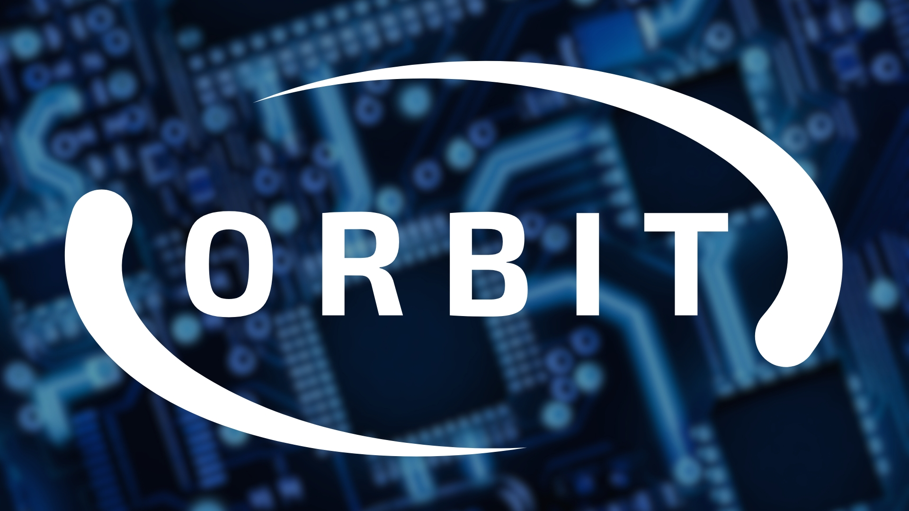

## What is ORBIT?
ORBIT began as kind of an ephemeral idea, but it's become the umbrella that all my "homelab" projects fall under. ORBIT isn't a project in and of itself, it's the collective experience provided by each of the individual projects, devices, and services that make up my homelab. Devices or projects that fall under the ORBIT umbrella receive a name consistent with the theme of ORBIT. Why? Because it's fun, and because I get awesome reactions when the naming scheme clicks for people.

## What are the goals of ORBIT?

## What does ORBIT look like?

## What does ORBIT consist of?
**ORBIT is made up of several key components**
- **The Hardware:** This is the foundation of ORBIT, providing the necessary infrastructure for all the other components to function. This includes everything from the servers and storage devices to the network equipment and power supplies.
- **The Network:** Network communication is essential to the operation of ORBIT. This includes everything from the physical network infrastructure to the virtual networks and services that enable communication between devices and systems.
- **The Software:** Software runs ORBIT. While this is a bit of a broad section, hardware and services are defined on their own so I will define software as the operating systems, hypervisors, and applications that run on the hardware and are not providing services "directly" to the user.
- **The Workflows:** Workflows tie ORBIT's layers together and allow it to function as a cohesive unit with less and less human intervention. This includes automations via scripts and GitHub Actions as well as the storage and versioning of ORBIT's various configurations.
- **The Services:** Services are the whole point of ORBIT. Services are what the user interacts with––the functionality that ORBIT as a collective aims to provide.
